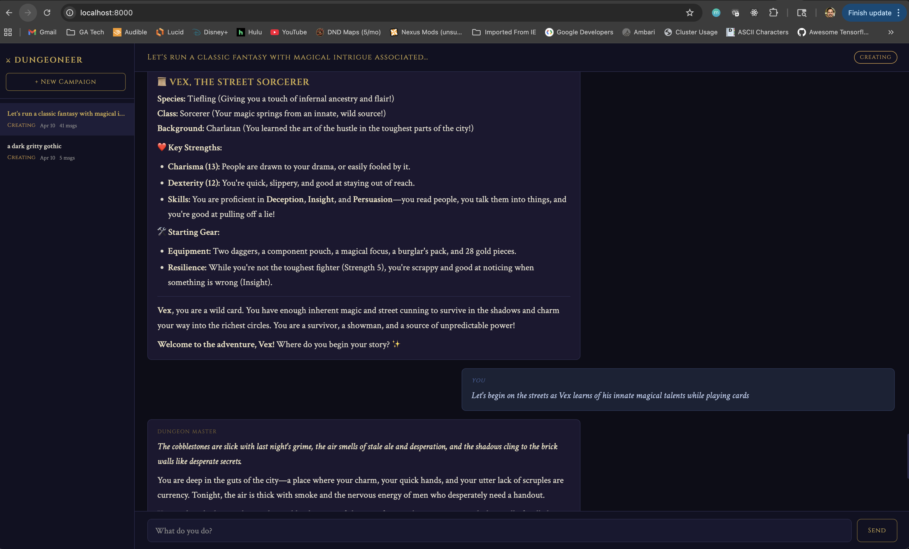

# dungeoneer
A passion project intending to combine the rigid structure of dnd with the creativity of generative AI using agentic methods.

## Initial Setup Option A - Docker
1. `docker build -t dungeoneer . && docker run --rm -it -p 8000:8000 --name dungeoneer dungeoneer`

## Initial Setup Option B - Local
1. Run `pip install -r requirements.txt`
2. You need to set environment variable `DUNGEONEER_MODEL` as the LLM you want to use:
   1. If using a Claude model, also set `ANTHROPIC_API_KEY=<your key>`
   2. If you want to use a free Ollama model, just set the `DUNGEONEER_MODEL` as the name of the model you want to use. You can install a free model by running `curl -fsSL https://ollama.com/install.sh | sh` to install ollama and then running something like `ollama pull gemma4` to get a free model from their [registry](https://ollama.com/search)
3. If you wish to store separate campaigns in a unified frontend, run `uvicorn src.agent.server:app --reload --port 8000` and then navigate your browser to `localhost:8000`
4. If you prefer a terminal experience, for a single campaign, run `python -m src.agent.chat`

## Examples
This is how the application looks:

There are story examples in the examples folder.

This is what the terminal-based combat experience looks like:

## Reference Material
I decided to utilize my own copy of the 2024 PHB for this project, incorporating the updated 2024 concepts as Python classes.