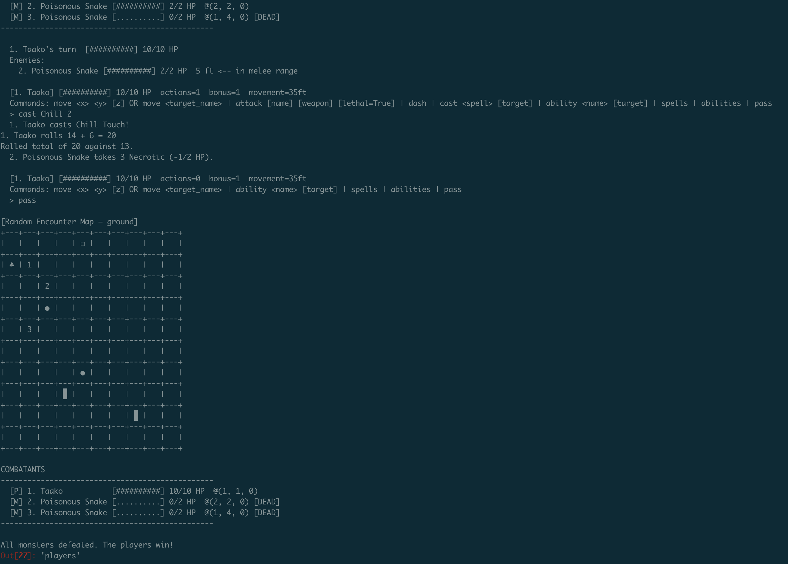

# dungeoneer
A passion project intending to combine the rigid structure of dnd with the creativity of generative AI using agentic methods.

## Setup
1. pip install -r requirements.txt
2. add a .env file to root folder with ANTHROPIC_API_KEY=<your key>
3. python -m src.agent.chat

## Reference Material
I decided to utilize my own copy of the 2024 PHB for this project, incorporating updated concepts.

## Examples
There are story examples in the examples folder. This is what combat looks like:
